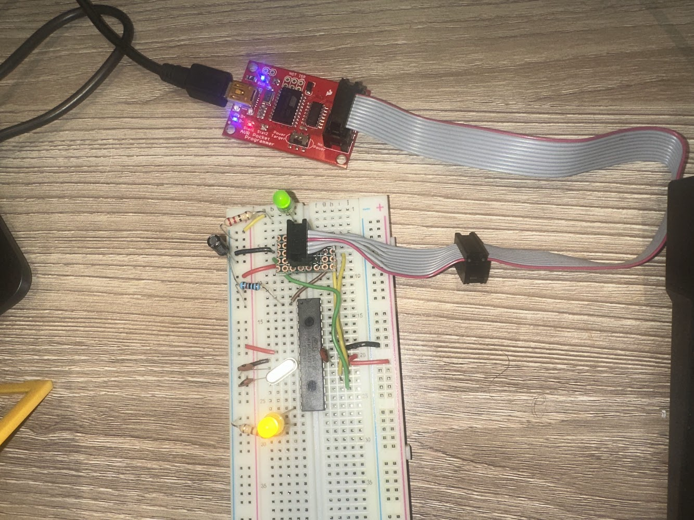

% Blink using ATmega328 on a breadboard with an Oscillator

The canonical _Hello World_ of Arduino for the ATmega328 on a breadboard. Note that
this is _not_ the same as ATmega328p (the pico-power version which is used in
Arduino Uno).

The program in this directory continues the instructions at
[this tutorial from All About Circuits](https://www.allaboutcircuits.com/projects/breadboarding-and-programming-the-atmega328p-and-attiny45-in-atmel-studio-7/)
with adding a 16Mhz Oscilator to the circuit and setting the low fuse byte
as described in
[the follow-on tutorial](https://www.allaboutcircuits.com/projects/atmega328p-fuse-bits-and-an-external-crystal-oscillator/).

The first step of building the circuit was described in
[Blink-ATmega328-breadboard](../Blink-ATmega328-breadboard/README.html).

This program will blink an LED attached to pin 13 of the ATmega328. Physical pin
13 is called **PIN_8** in the Arduino IDE (as defined in wiring.h, I believe).

## Circuit

```
Basic Power:
PIN1: Reset -> R10K -> GND
PIN7: Vcc
PIN8: GND
PIN20: Vcc
PIN21: Vcc
PIN22: GND

Oscilator:
PIN9: OSC -> 22pF -> GND
PIN10: OSC -> 22pf -> GND

Programming (connection to AVR Pocket Programmer):
PIN1: Reset -> RST
PIN17: MOSI -> MOSI
PIN18: MISO -> MISO
PIN19: SCK -> SCK

LED:
Pin13 -> LED -> R220 -> GND
```

Place ATmega328 on breadboard and wire circuit as above. 
Connect AVR Pocket Programmer to Breadboard:

```
AVR Pocket Progammer Pin-out

  * MISO | VCC
    SCK  | MOSI
    RST  | GND

```

_Note the addition of the oscilator to the base circuit from the
[Blink-ATmega328-breadboard](../Blink-ATmega328-breadboard/README.html)
design_.

Here is a photo of the built circuit:



## Install the Blink program with no oscillator

Start by installing the blink program from
[Blink-ATmega328-breadboard](../Blink-ATmega328-breadboard/README.html)
which uses `F_CPU=1000000` for a speed of 1MHz using the internal
oscillator.

## Setting the Low Fuse Byte

The article in
[this tutorial](https://www.allaboutcircuits.com/projects/atmega328p-fuse-bits-and-an-external-crystal-oscillator/).
describes how to calculate the fuse byte value.  As per the
article, we set the low fuse byte to **0xFF** using avrdude.

The fuse can be queried like this (on Mac OS X):

```
$ /Users/alanpearson/Library/Arduino15/packages/arduino/tools/avrdude/6.3.0-arduino17/bin/avrdude \
   -C /Users/alanpearson/Library/Arduino15/packages/arduino/tools/avrdude/6.3.0-arduino17/etc/avrdude.conf \
   -c usbtiny -p atmega328

avrdude: AVR device initialized and ready to accept instructions

Reading | ################################################## | 100% 0.01s

avrdude: Device signature = 0x1e9514 (probably m328)

avrdude: safemode: Fuses OK (E:FF, H:D9, L:62)

avrdude done.  Thank you.

```

The fuse can be written with the addition of the argument `-U lfuse:w:0xFF:m` to the 
above command:

```
$ /Users/alanpearson/Library/Arduino15/packages/arduino/tools/avrdude/6.3.0-arduino17/bin/avrdude \
    -C /Users/alanpearson/Library/Arduino15/packages/arduino/tools/avrdude/6.3.0-arduino17/etc/avrdude.conf \
    -c usbtiny -p atmega328 -U lfuse:w:0xFF:m

avrdude: AVR device initialized and ready to accept instructions

Reading | ################################################## | 100% 0.01s

avrdude: Device signature = 0x1e9514 (probably m328)
avrdude: reading input file "0xFF"
avrdude: writing lfuse (1 bytes):

Writing | ################################################## | 100% 0.01s

avrdude: 1 bytes of lfuse written
avrdude: verifying lfuse memory against 0xFF:
avrdude: load data lfuse data from input file 0xFF:
avrdude: input file 0xFF contains 1 bytes
avrdude: reading on-chip lfuse data:

Reading | ################################################## | 100% 0.00s

avrdude: verifying ...
avrdude: 1 bytes of lfuse verified

avrdude: safemode: Fuses OK (E:FF, H:D9, L:FF)

avrdude done.  Thank you.
```

Upon setting the fuse, the LED starts blinking 16x faster, since we
are now using a 16MHz clock.

## Updating the Blink program

The Makefile works with GNU Make 3.81 on Ubuntu, Mac OS X or Windows.

The Makefile in this directory specifies `MCU=atmega328`. Additionally it
sets `F_CPU=16000000` to set the clock speed to match the external
oscillator of this circuit.

The Blink program in this directory is the same as in the previous step.

Since we are using AVR Pocket Programmer, we use `make upload-isp` rather than
`make upload`.

```
$ make
$ make upload-isp
```

After installing the blink program with the 16Mhz clock defined, the LED
should start flashing at 1/2 second intervals again.

## References

 * [https://www.allaboutcircuits.com/projects/breadboarding-and-programming-the-atmega328p-and-attiny45-in-atmel-studio-7/](https://www.allaboutcircuits.com/projects/breadboarding-and-programming-the-atmega328p-and-attiny45-in-atmel-studio-7/)
 * [https://www.allaboutcircuits.com/projects/atmega328p-fuse-bits-and-an-external-crystal-oscillator/](https://www.allaboutcircuits.com/projects/atmega328p-fuse-bits-and-an-external-crystal-oscillator/)

