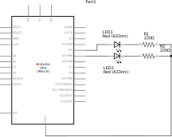
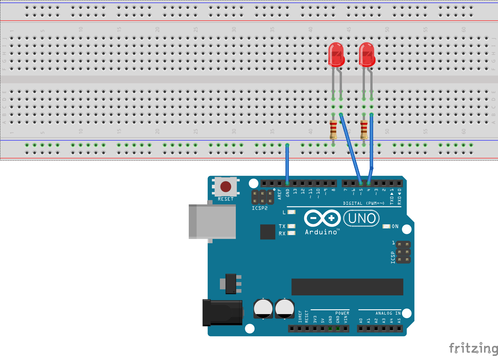

# Blink 2

This program will blink a pair of LEDs attached to pins 4 and 5.

## Circuit

### Text Description

```
Pin4 -> LED -> R220 -> GND
Pin5 -> LED -> R220 -> GND
```

Connect Arduino Uno to USB port and wire circuit as above. 

### Schematic






## Install (Linux)

Makefile.gnu works on Ubuntu and expects Arduino IDE installed
in /usr/local/arduino-1.8.10.

```
$ make -f Makefile.gnu
$ make -f Makefile.gnu upload
```

## Install (Windows 10)

Makefile.win32 works on Windows 10 with Microsoft Visual Studio's `NMAKE` utility.
The Makefile.win32 expects Arduino IDE to be installed in `D:\Arduino`.

```
CMD> nmake /F Makefile.win32
CMD> nmake /F Makefile.win32 upload
```

## Notes

### Linux 
* Uses `/dev/ttyACM0` to talk to Arduino on Linux

### Windows
* Uses `COM4` to talk to Arduino (but use Device Manager > Ports to find COM port).