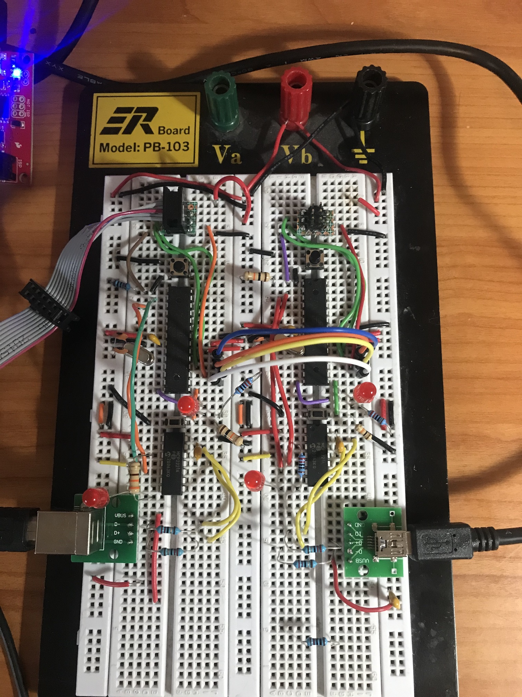

# SPI Test

Test program to test SPI between two ATmega328 MCUs.

This program uses two circuits like the [Serial]()../serial/README.md) Test
Circuit, connected together for SPI:

```
MCU 1                MCU2

(PB5)[SCK]   <--->    [SCK](PB5)
(PB4)[MISO]  <--->   [MISO](PB4)
(PB3)[MOSI]  <--->   [MOSI](PB4)
(PB2)[SS]    <--->     [SS](PB2)
```

The test uses the code in `spi-controller` as the controller and the code in
`spi-perhipheral` as the perhipheral.  Install controller on one MCU and
perhipheral on the other using `make upload-isp`.

It seems that it is safe to have the SPI wires hooked up between the two
MCUs and also be used as the ISP pins for the AVR pocket programmer.


