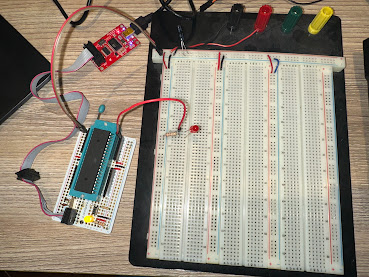

% Blink on ATmega644pa

## Overview

Tested on the Boarduino with the ATmega644pa chip in the ZIF socket



## Wiring

Connect LED to pin 40 (top right pin)

Use the AVR Pocket programmer connected to 6-pin header with cable going
to left side of board as shown.

## Compile and Build

```
make
make upload-isp
```

## Setting Fuse bytes

By default, the fuse bits use the 1Mhz internal clock. The boarduinio has a 20Mhz
crystal. To use this, the fuse bits must be set appropriately, and the program
compiled with `F_CPU=20000000`, which is set in `common.mk`.


Use the [AVR Fuse Calculator](https://www.engbedded.com/fusecalc/) to calculate fuse
values. We want 

 * Full Swing Oscillator; 16CK + 0ms startup; BOD enabled
 * no clock division
 
which yields a value for low fuse of 0xD7.

### Reading fuse bytes

Use this command to read the fuse bytes.

```
/Users/alanpearson/Library/Arduino15/packages/arduino/tools/avrdude/6.3.0-arduino17/bin/avrdude    -C /Users/alanpearson/Library/Arduino15/packages/arduino/tools/avrdude/6.3.0-arduino17/etc/avrdude.conf    -c usbtiny -p m644p 
```

### Writing fuse bytes

We write 0xD7 to the low fuse byte.

```
/Users/alanpearson/Library/Arduino15/packages/arduino/tools/avrdude/6.3.0-arduino17/bin/avrdude    -C /Users/alanpearson/Library/Arduino15/packages/arduino/tools/avrdude/6.3.0-arduino17/etc/avrdude.conf    -c usbtiny -p m644p   -U lfuse:w:0xD7:m
```

