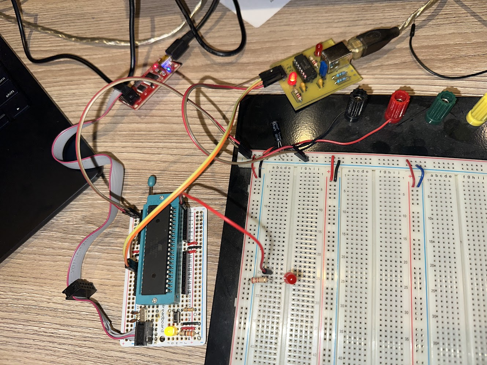

% Serial communication with on ATmega644pa on breadboard

## Overview

Tested on the Boarduino with the ATmega644pa chip in the ZIF socket



## Wiring

Use the AVR Pocket programmer connected to 6-pin header with cable going
to left side of board as shown.

Connect USB +/- to VCC and Ground of breadboard

Connect USB Tx to TXD0/PD1/Pin 15 of ATmega644pa
Connect USB Rx to RXD0/PD0/Pin 14 of ATmega644pa

## Compile and Build

```
make
make upload-isp
```

## Connect to serial console

Mac OS X:

```
screen -p /dev/cu.usbmodem141101 115200
```

The nice thing is that since we are using AVR Pocket Programmer, not serial, to 
install code, we don't need to disconnect `screen` to upload a new program.

