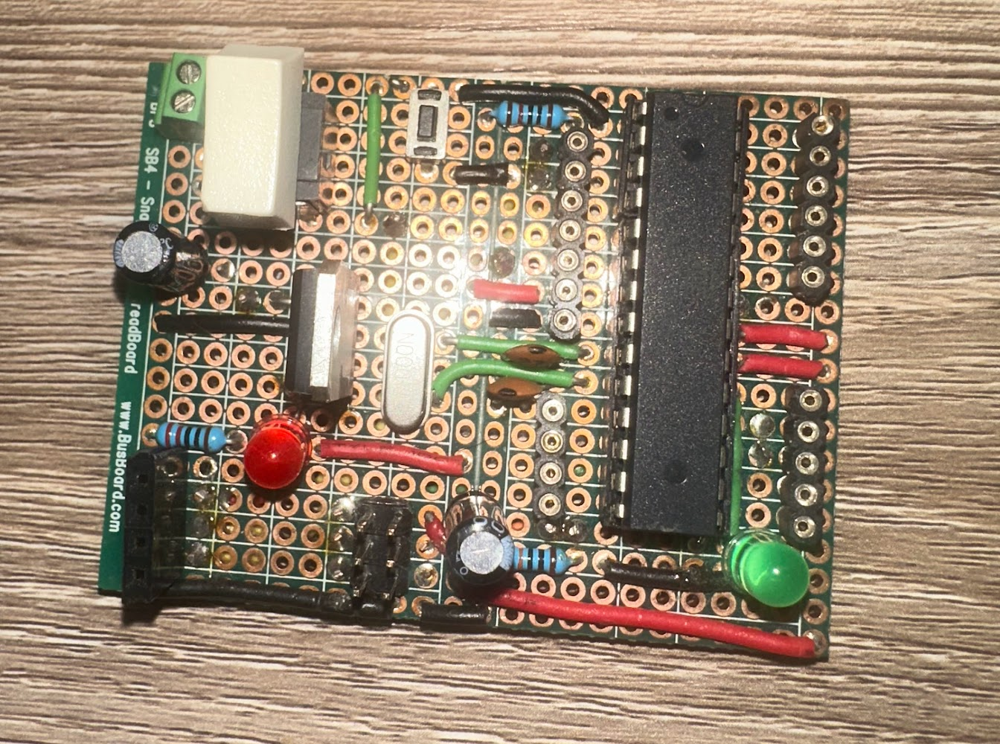
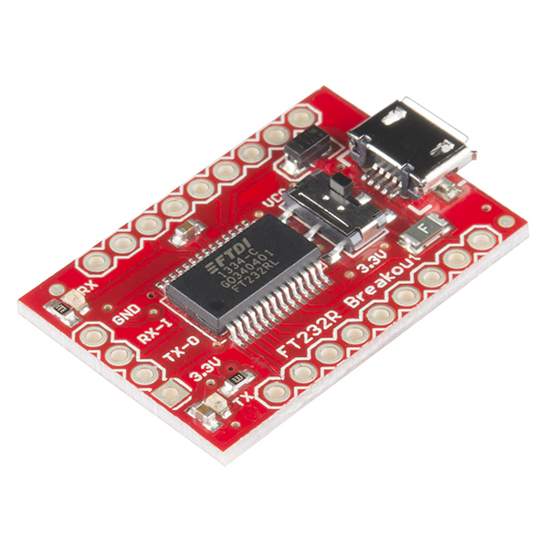
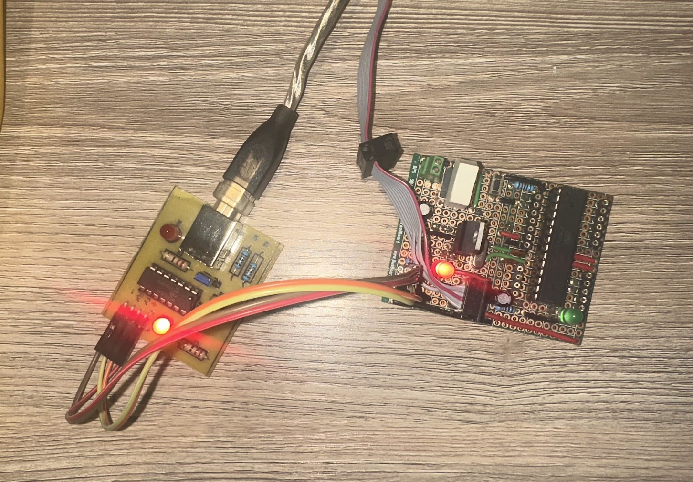
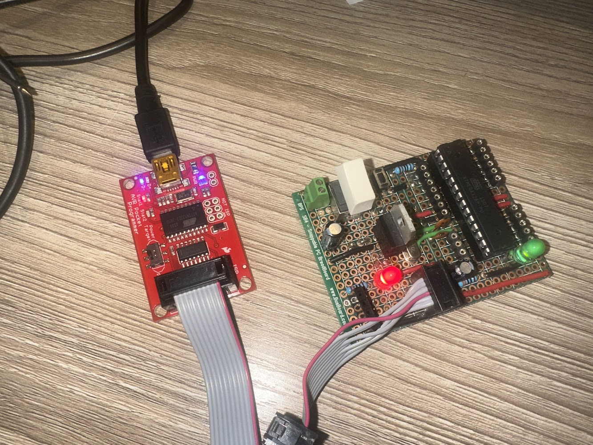

% Blink with Serial communication

This program will blink an LED attached to pin 13.

## Circuit

This program was tested with the homebuilt "Breaduino" on a
perfboard that I found in my circuits cabinet.  I'm not sure
when or why I built this. It has:

* an ATmega329P microcontroller
* a 16Mhz oscillator
* An external power connector with switch
* A connector for the AVR Pocket Programmer
* A connector for a USB interface



## FT232 breakout (DID NOT WORK!!!)

* [SparkFun product page](https://www.sparkfun.com/products/12731)
* [FTDI Tutorial at SparkFun](https://learn.sparkfun.com/tutorials/how-to-install-ftdi-drivers)
* [FTDI drivers](https://ftdichip.com/drivers/vcp-drivers/)



Using the FT232 breakout required me to install a driver on Mac OS X.

On my Work Mac using Mac OS 14, it did not allow the driver to run. Also was not able to
get FTDI drivers to run on Windows laptop (gigantic) or on personal Mac laptop (ramona).

So I've given up on FTDI. However...

## Homebuilt USB interface

I was able to get this breaduino talking over Serial using my homebuilt USB
interface and some Jumper Wires.



The pinout on the USB Interface card is:

```
1  VCC
2  Tx
3  Rx
4  GND
```

The pinout on the boarduino for USB interface is (from top to bottom):

```
1  GND
2  VCC
3  Rx
4  Tx
```

Wiring this up using jumpers to the USB Intface card, I was able to connect
on my Windows laptop to COM4: in the Arduino IDE and get Serial output to
display.


## Install

Makefile works with GNU Make 3.81 on Ubuntu or Mac OS X. The location of the
Arduino IDE is specified in the architecture-specific __.mk__ files in
`../build/`.

Attach the AVR Pocket Programmer and upload the program using `make upload-isp`



```
$ make
$ make upload-isp
```

## Serial communications

The USB interface board wired as above can be used for Serial communications
with this board.


Then on Mac OS X, use screen to communicate with the device:

```
$ screen -port /dev/cu.usbmodem1411101 115200 
```

The device will likely be different than the path above. Look in the
`/dev` directory for a `cu.usbmodem*` device. The numbers seem to correspond
with which Hub it is connected.

You can't update the device through the USB port when screen is running. 
To update the device, you have to kill the serial connection with `^A - K`.


For Windows, I wrote a Serial Monitor program (in the WindowsSeraial repo,
run monitor.exe in the Monitor directory).
