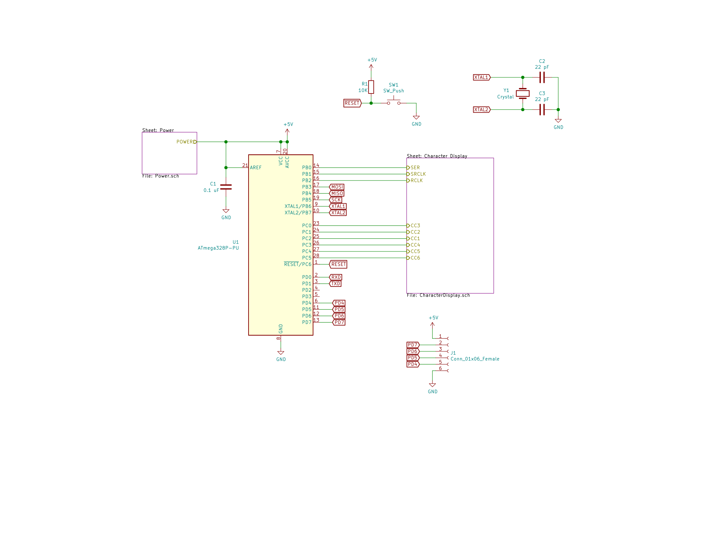
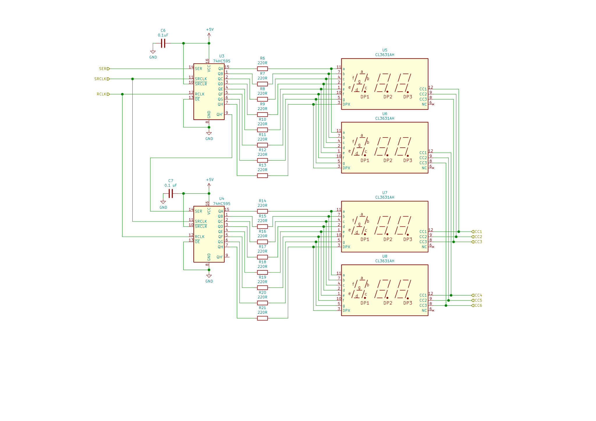
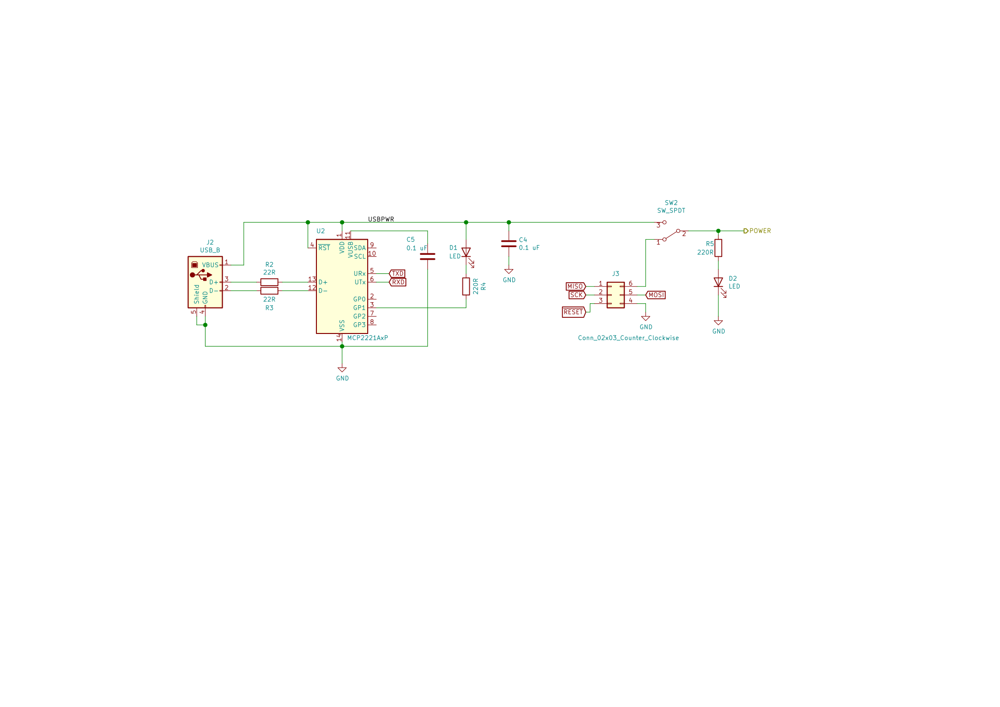

# MSFS Switch Panel > Radio Display

This project contains the ATmega328 code for the radio display 
controller of the MSFS Switch Planel.

The radio display has two 6-character seven-segment displays with
two daisy chained shift registers. Each 6-character display is 
built using a pair of 3-digit seven-segment displays.

## Circuit

The circuit for this is in CircuitDesigns/Multi-Seven-Seg-Controller/Prototype-A.

