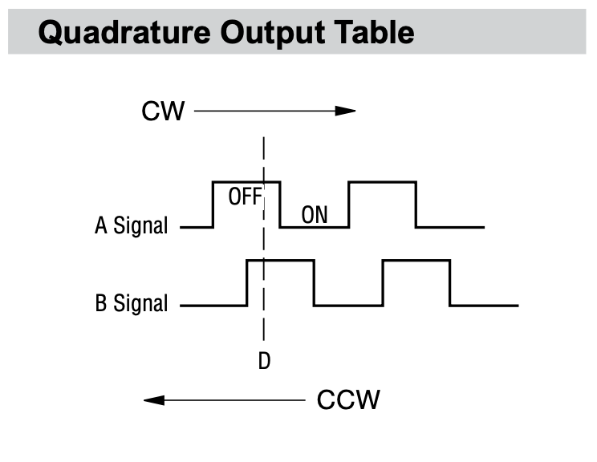
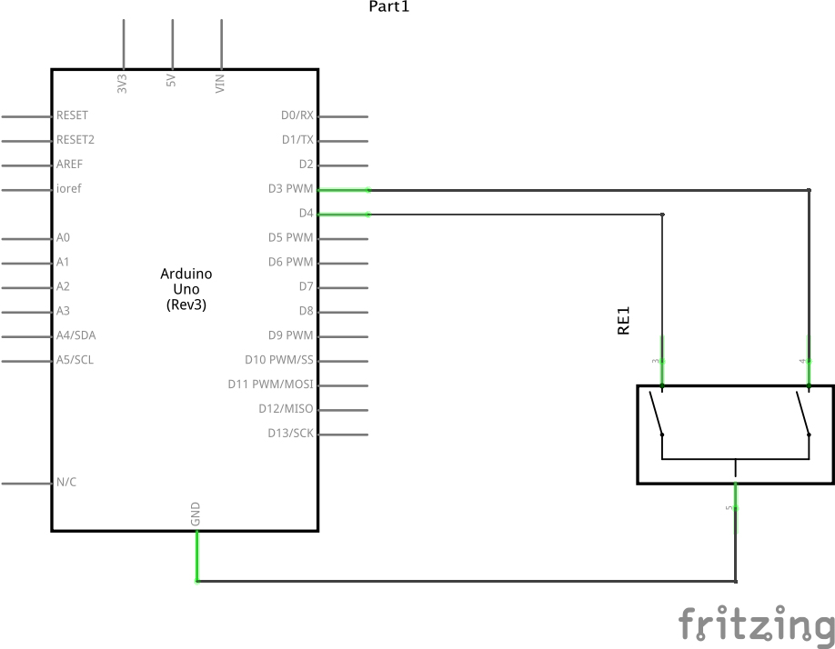
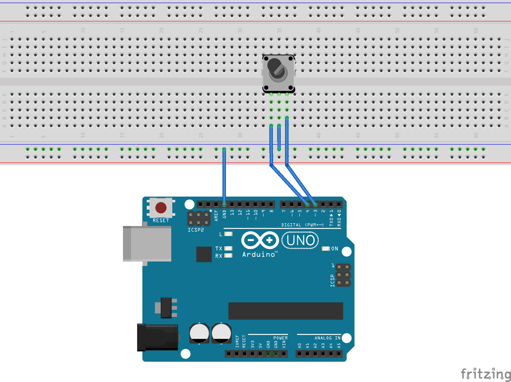

# Rotary Encoder

This directory contains code experiments interfacing Arduino to a
rotary encoder.

The rotary encoder operates by monitoring a wave form from the two switches



## Resources
* [https://learn.adafruit.com/trinket-usb-volume-knob/code](https://learn.adafruit.com/trinket-usb-volume-knob/code)
* [https://howtomechatronics.com/tutorials/arduino/rotary-encoder-works-use-arduino/](https://howtomechatronics.com/tutorials/arduino/rotary-encoder-works-use-arduino/)
* [Datasheet of Bourn PEC11 Rotary Encoder](https://cdn-shop.adafruit.com/datasheets/pec11.pdf)

## Circuit

This Circuit was built using [Bourns PEC11 Rotary Encoder](../../ElectronicsNotebook/Datasheets/RotaryEncoder/Bourns-PEC11/index/md).

Intrnal pull-up resistors of the Arduino pull the voltage up to 5V.

### Schematic



### Breadboard




## Install (Mac OS X)

Makefile works on Mac OS X and expects Arduino IDE installed
in /Applications/Arduino

```
$ make
$ make upload
```

## Install (Windows 10)

Makefile.win32 works on Windows 10 with Microsoft Visual Studio's `NMAKE` utility.
The Makefile.win32 expects Arduino IDE to be installed in `D:\Arduino`.

```
CMD> nmake /F Makefile.win32
CMD> nmake /F Makefile.win32 upload
```

## Notes

### Linux 
* Uses `/dev/ttyACM0` to talk to Arduino on Linux

### Mac OS X 
* Uses `/dev/tty.usbmodem142401` to talk to Arduino on Mac OS X

### Windows
* Uses `COM4` to talk to Arduino (but use Device Manager > Ports to find COM port).
