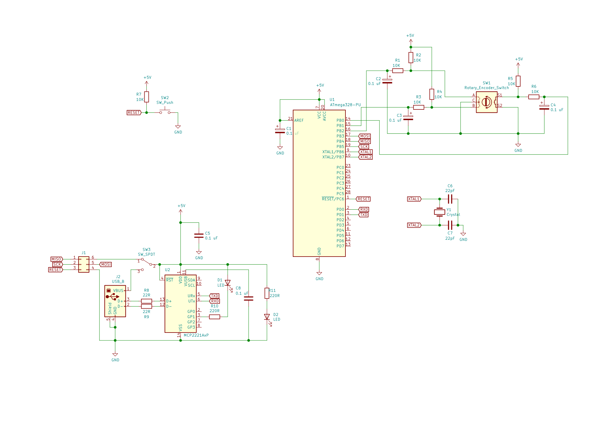
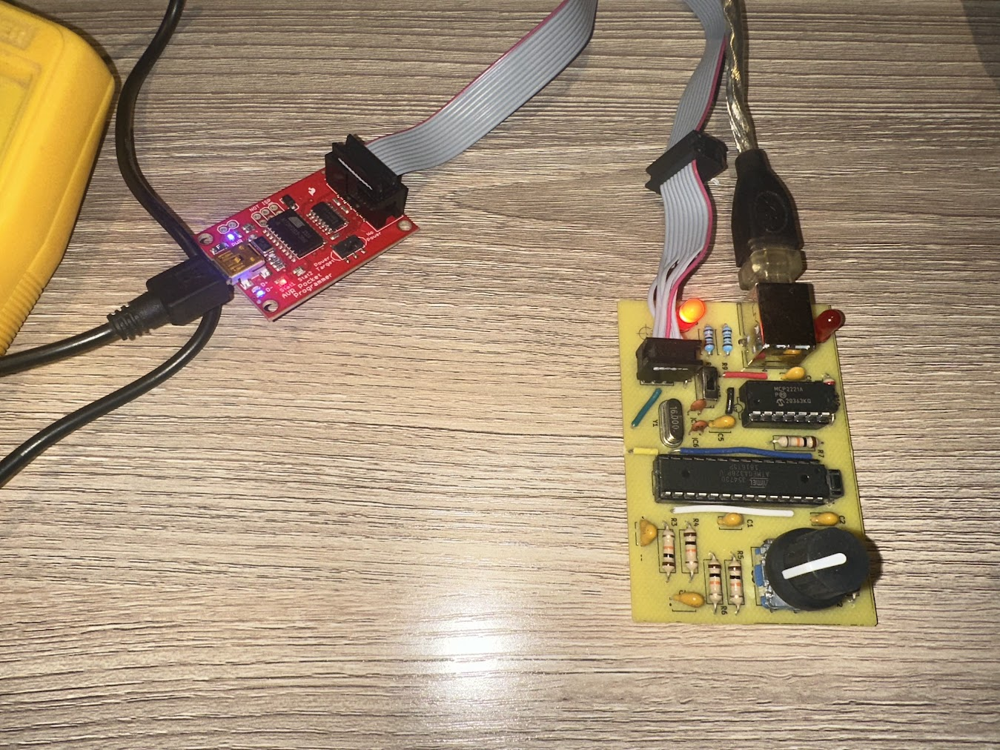

# Rotenc-Serial

Code for ATmega328 on a boarduino with a rotary encoder.

This code uses the circuit of CircuitDesigns/Boarduino, which includes an
ATmega328, USBInterface and Rotary Encoder with hardware debounce on a
single board.



I have created a build of this circuit:




This can be programmed with the AVR Pocket programmer using

```
make
make upload-isp
```

Connect the Serial Interface to USB and monitor the output
with the WindowSerial/Monitor program on Windows or
with `screen` on a Mac.

