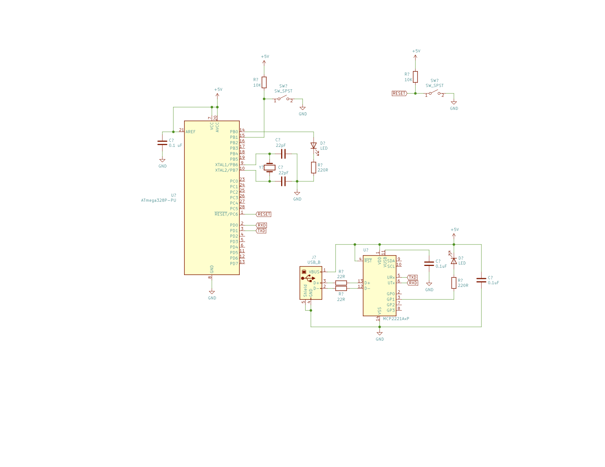

# Serial-Test

This program was written up to test Serial communications using the 
[MCP2221](http://velouria/ElectronicsNotebook/Datasheets/USB/MCP2221.pdf)

The program also uses an LED for output and a push button to make things a bit
more interesting.

