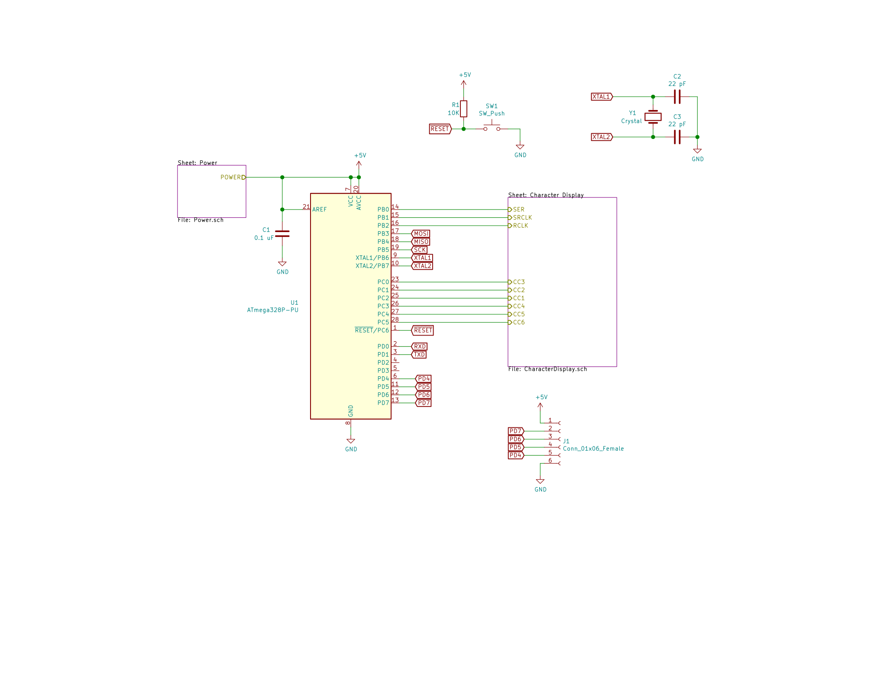
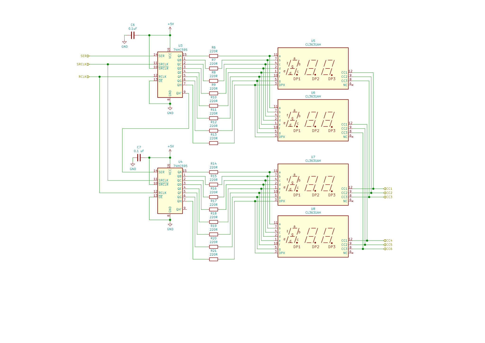
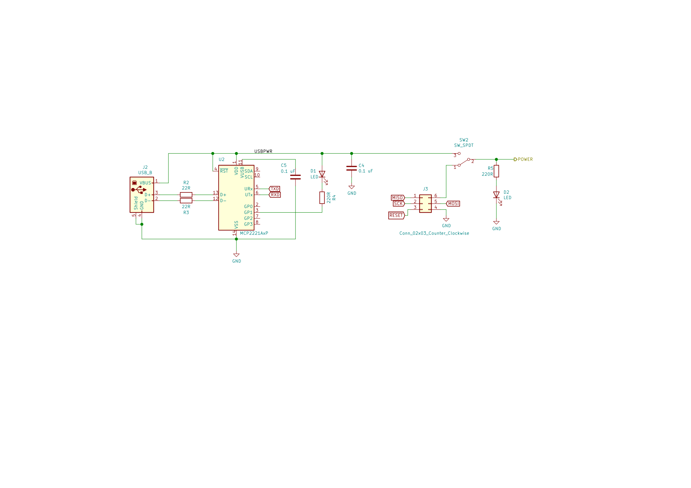

# 6 Digit Shift Register

This project drives two 6-character seven-segment displays using
two daisy chained shift registers. Each 6-character display is 
built using a pair of 3-digit seven-segment displays.  The two
shift registers are daisy-chained together.

The first 6 digit display shows a 1/10th second timer.
The second display shows a count of time spent in the shift out
routine in microseconds out of every 100 milliseconds.

## Circuit

The circuit for this is in CircuitDesigns/Multi-Seven-Seg-Controller/Prototype-A.

