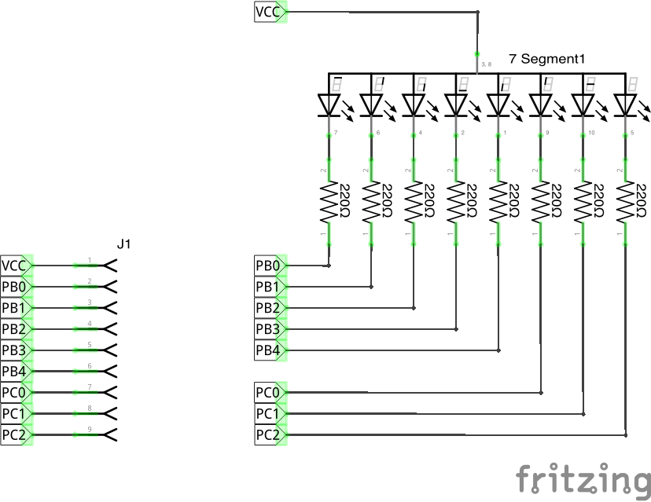
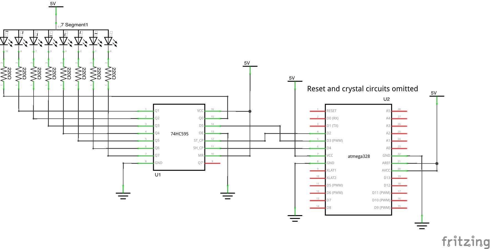

# Seven Segment Displays

## Direct wired

These projects directly wire the ATmega328 to the seven segment display using
8 digital pins.  These projects share a common circuit.

### Circuit

This cicuit uses a single 7-Segment display, part
[5161BS](http://velouria.lan/ElectronicsNotebook/Datasheets/SevenSegment/5161BS.pdf). 
The circuit was built on a breadboard and wired to a "boarduino" with an
ATmega328. The net labels in the schematic represent the pins on the ATmega328
to which the segments are connected (not wiring or physical pins).

* [Fritzing Sketch](circuits/seven-seg-direct.fzz)

### Projects

* __cycle__ - Cycle through lighting the outer segments. Uses Wiring pin
  numbers and Wiring functions `pinMode` and `digitalWrite` to turn on the
  segments
* __display-digit__ - Display digits 0 - 9 on the seven segment display. Uses
  direct PORT access to turn on the segments.

## Shift Register

### Circuit

This circuit uses a [74HC595 Shift Register](http://velouria.lan/ElectronicsNotebook/Datasheets/pdf/sn74hc595.pdf) to connect to the ATmega328.

* [Fritzing Sketch](circuits/seven-seg-shift-register.fzz)

### Projects

